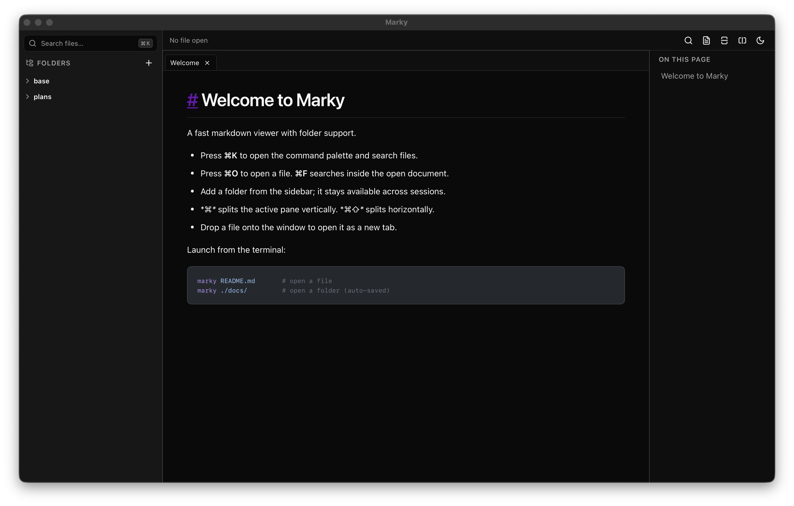

# Marky

A fast, native markdown viewer for macOS. Open any `.md` file from the terminal and get beautiful rendering of tables, code blocks, task lists, math, and diagrams — with live reload when the file changes on disk.

Built with Tauri v2, React, and a markdown-it rendering pipeline.



## Features

- **CLI-first** — `marky README.md` opens a window. `marky ./docs/` opens a folder.
- **Live reload** — edits on disk (from your editor, Claude, etc.) update the view instantly.
- **Folders** — add folders as persistent workspaces (Obsidian-style). They appear in a sidebar and restore on launch.
- **Cmd+K command palette** — fuzzy-search files across all open folders, powered by [nucleo](https://github.com/helix-editor/nucleo).
- **Syntax highlighting** — [Shiki](https://shiki.style) with VS Code themes for accurate, beautiful code blocks.
- **Math** — KaTeX rendering for `$inline$` and `$$display$$` math.
- **Mermaid diagrams** — fenced `mermaid` blocks render as SVG.
- **GFM** — tables, task lists, strikethrough, autolinks, footnotes.
- **Light & dark themes** — follows system preference or toggle manually.
- **Sanitized rendering** — all HTML is run through DOMPurify. Safe to view untrusted markdown.
- **Small & fast** — native webview, no Electron. Production `.dmg` is under 15 MB.

## Install

### Homebrew

_NOTE_: I am currently waiting for apple developer review so for the time being the app is not signed. This will be fixed soon

```bash
brew tap GRVYDEV/tap
brew install --cask GRVYDEV/tap/marky
# This is temporary until I can sign the binary
xattr -cr /Applications/Marky.app
```

### From source

Requires [Rust](https://rustup.rs/), [Node.js](https://nodejs.org/), and [pnpm](https://pnpm.io/).

```bash
git clone https://github.com/GRVYDEV/marky.git
cd marky
pnpm install
pnpm tauri build
./scripts/install-cli.sh
```

The install script symlinks `marky` to `~/.local/bin/`. Make sure that's on your `PATH`:

```bash
# bash/zsh
export PATH="$HOME/.local/bin:$PATH"

# fish
set -Ux fish_user_paths $HOME/.local/bin $fish_user_paths
```

## Usage

```bash
# Open a single file
marky README.md

# Open a folder as a workspace
marky ./docs/

# Open with no args — restores your last session
marky
```

### Keyboard shortcuts

| Shortcut      | Action                              |
| ------------- | ----------------------------------- |
| `Cmd+K`       | Command palette (fuzzy file search) |
| `Cmd+O`       | Open file                           |
| `Cmd+Shift+O` | Add folder                          |
| `Cmd+F`       | Search in page                      |

## Development

```bash
pnpm install
pnpm tauri dev       # dev server with HMR
```

### Run tests

```bash
# Frontend
pnpm test

# Rust
cd src-tauri && cargo test
```

### Project structure

```
src-tauri/       Rust backend — CLI, file I/O, file watching, folder registry, fuzzy search
src/             React frontend — markdown pipeline, UI components, theme
src/components/  App components (Viewer, Sidebar, CommandPalette, etc.)
src/components/ui/  shadcn/ui primitives
src/lib/         Core logic (markdown-it config, Shiki, Tauri IPC wrappers)
src/styles/      Tailwind base + markdown prose styles
scripts/         Install helpers
```

## Stack

| Layer               | Tech                                                      |
| ------------------- | --------------------------------------------------------- |
| Desktop shell       | [Tauri v2](https://v2.tauri.app)                          |
| Frontend            | React + TypeScript + Vite                                 |
| Markdown            | [markdown-it](https://github.com/markdown-it/markdown-it) |
| Syntax highlighting | [Shiki](https://shiki.style)                              |
| Math                | [KaTeX](https://katex.org)                                |
| Diagrams            | [Mermaid](https://mermaid.js.org)                         |
| Fuzzy search        | [nucleo](https://github.com/helix-editor/nucleo)          |
| UI primitives       | [shadcn/ui](https://ui.shadcn.com)                        |
| Styling             | [Tailwind CSS](https://tailwindcss.com)                   |
| File watching       | [notify](https://github.com/notify-rs/notify)             |

## Roadmap

- **x86 & Linux support** — currently macOS ARM only; expanding to x86 macOS and Linux
- **Built-in AI chat** — chat with Claude Code or Codex directly inside your markdown documents
- **Git diff review** — view and review local git diffs without leaving the app

## Contributing

Contributions are welcome! Please open an issue first to discuss what you'd like to change.

```bash
pnpm install
pnpm tauri dev
```

Before submitting a PR:

- Run `pnpm test` and `cd src-tauri && cargo test`
- Run `pnpm typecheck`
- Actually open a markdown file with `pnpm tauri dev` and verify it renders correctly
